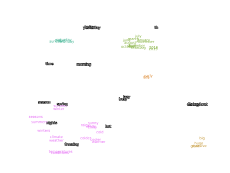

# PyTorch Word2Vec implementation

## Description

Unofficial implementation of the [Efficient Estimation of Word Representations in Vector Space](https://arxiv.org/abs/1301.3781) paper written in PyTorch with code for training and demonstration of the properties of the trained model. Emphasis was placed on the Skip-gram Model only.

## Content

Files to be familiarized with:

1. `word2vec.pth` is a pre-trained model on the [Amazon Fashion dataset](https://cseweb.ucsd.edu/~jmcauley/datasets/amazon_v2/) with a 4000-word vocabulary,
2. `inference.ipynb` contains the playground and demonstrates some properties of the model,
3. `train.ipynb` trains **word2vec** from scratch. Use it if you want to customize the training process for yourself,
4. `extra/cloud.svg` shows [t-SNE](https://en.wikipedia.org/wiki/T-distributed_stochastic_neighbor_embedding) visualization of the most distinct word clusters.

## Installation

```bash
git clone https://github.com/tejpaper/word2vec.git
cd word2vec
pip install -r requirements.txt
```

## Some clusters

|  |
|:--------------------------------:|
|    **Emotions and feelings**     |


|  |
|:---------------------:|
|      **Family**       |

|  |
|:----------------------:|
|      **Seasons**       |

|  |
|:----------------------:|
|      **Numbers**       |

|  |
|:---------------------:|
|      **Colors**       |

|  |
|:-------------------------:|
|      **Body parts**       |

|  |
|:----------------------:|
|      **Clothes**       |

|  |
|:--------------------:|
|      **Sizes**       |

## License

MIT